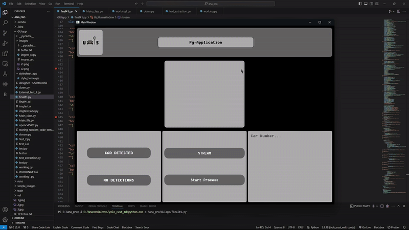

# 🚗 AI-Based Parking Management System

An intelligent parking solution built to tackle urban traffic congestion by using AI for vehicle detection, number plate recognition, and smart space allocation.

## 📌 Overview

This system is designed to:

- Detect incoming and outgoing vehicles using a custom-trained **YOLOv8 object detection model**.
- Extract license plate numbers using **EasyOCR**.
- Provide administrators with a **Windows-based control panel** for real-time monitoring and record-keeping.
- Offer **mobile app guidance** to users for locating the nearest available parking space.
- Help reduce road congestion and decrease accident rates caused by traffic by up to **64%**.
- Summarize weekly data for better analysis and optimization.

## 🛠 Features

- 🚘 Real-time Vehicle Detection using YOLOv8  
- 🔢 License Plate Recognition using EasyOCR  
- 🖥 Desktop App for Admin Control (built with PyQt5)  
- 📱 Mobile App for User Navigation to Nearest Parking  
- ☁️ Firebase for Realtime Data Sync and Storage  
- 📊 Weekly Data Summary Reports
- 📷 Integration with **ESP32-CAM** and **Arduino** for hardware communication

## 🧰 Tech Stack

| Component       | Technology Used         |
|----------------|--------------------------|
| Object Detection | YOLOv8 (Custom-trained)  |
| OCR              | EasyOCR                 |
| Desktop App      | Python, PyQt5           |
| Mobile App       | React.js                |
| Database         | Firebase Realtime DB    |
| Embedded Systems | Embedded C, ESP32-CAM, Arduino |
| Backend Logic    | Python                  |

## 📱 Mobile App

- Displays nearest parking zones using location data.
- Integrates seamlessly with backend data to provide real-time availability.
  
## 🖥 Admin Control Panel

- View, monitor, and manage all entries/exits.
- Analyze summary statistics and traffic trends.
  
## 💡 Impact

- 🚦 Reduced traffic congestion by optimizing parking space utilization.
- ⚠️ Lowered road accidents due to disorganized parking by **64%**.
- 🌍 Contributes toward smarter and safer cities.

---

## 🚀 Getting Started

Clone the repo

   ```bash
   git clone https://github.com/yourusername/ai-parking-system.git
   cd ai-parking-system
```

## Demo


